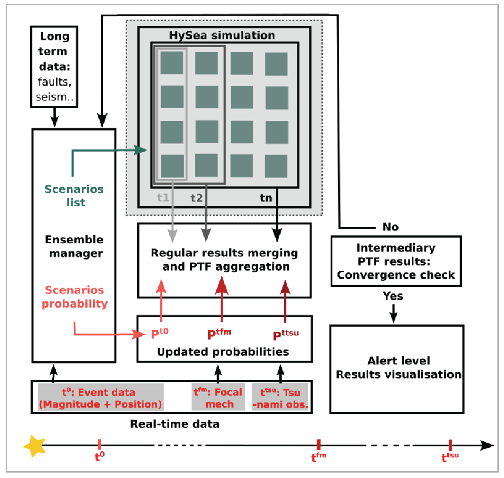

# PyCOMPSs implementation of Probabilistic Tsunami Forecast (PTF) 

Licence: Creative Commons Attribution-NonCommercial-NoDerivatives 4.0  

PTF explicitly treats data- and forecast-uncertainties, enabling alert level definitions according to any predefined level of conservatism, which is connected to the average balance of missed-vs-false-alarms.  

The PyCOMPSs PTF workflow was developed under the eFlows4HPC project (https://eflows4hpc.eu/) funded by the European High-Performance Computing Joint Undertaking (JU) under grant
agreement No 955558.

  

The Faster-Than-Real-Time tsunami simulation is performed by the Tsunami-HySEA code, developed by the EDANYA group at the University of Málaga, Spain: https://github.com/edanya-uma/TsunamiHySEA  

The eFlows4HPC PTF Workflow
===========================   

The figure below shows the outline of the eFlows4HPC Probabilistic Tsunami Forecast workflow.
The time axis extends from the earthquake occurrence to the output of Alert Levels.
Input to the system comes from time-invariant geophysical background information and from
near real-time data inputs. A given earthquake alert is associated with a large number of potential
scenario descriptions and, until convergence is reached, Faster-Than-Real-Time tsunami simulations are
carried out to assess the outcomes of each scenario.




Operation
=========   

A typical execution using PyCOMPSs is carried out using a command of the following format:  

```
enqueue_compss --num_nodes=5 --exec_time=120 --env_script=$PWD/env.sh \
  $PWD/Code/ptf_workflow.py --seistype BS --kagan_weight 1 --mare_weight 0 \
  --hours 1 --group_sims 4 --cfg from_template --event event=2003_0521_boumardes \
  --parameters_file $PWD/parfiles.txt --user_pois $PWD/user_pois.txt \
  --data_path /gpfs/projects/bsc44/PTF_WF/data/ \
  --templates_path /gpfs/projects/bsc44/PTF_WF/templates/ --run_path $PWD/Run/
```

Literature
==========

The basis Probabilistic Tsunami Forecast algorithm and results are described in:  

Selva et al. (2021),  "Probabilistic tsunami forecasting for early warning",  
*Nature Communications*, v12,   http://dx.doi.org/10.1038/s41467-021-25815-w  

  

(To be added:

CITATION.cff  
CITING.md  
CONTRIBUTING.md  
CODE_OF_CONDUCT.md  

)

