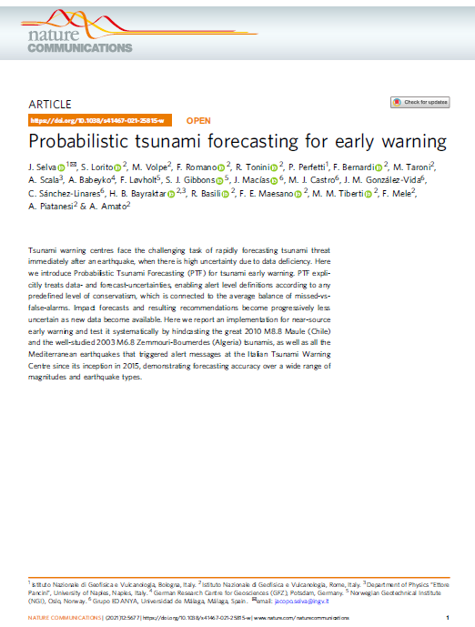

# PyCOMPSs implementation of Probabilistic Tsunami Forecast (PTF) 

Licence: Creative Commons Attribution-NonCommercial-NoDerivatives 4.0  

PTF explicitly treats data- and forecast-uncertainties, enabling alert level definitions according to any predefined level of conservatism, which is connected to the average balance of missed-vs-false-alarms.  

The PyCOMPSs PTF workflow was developed under the eFlows4HPC project (https://eflows4hpc.eu/) funded by the European High-Performance Computing Joint Undertaking (JU) under grant
agreement No 955558.

  

Literature
==========

The basis Probabilistic Tsunami Forecast algorithm and results are described in:  

Selva et al. (2021),  "Probabilistic tsunami forecasting for early warning",  
*Nature Communications*, v12,   http://dx.doi.org/10.1038/s41467-021-25815-w  

  

(To be added:

CITATION.cff  
CITING.md  
CONTRIBUTING.md  
CODE_OF_CONDUCT.md  

)

